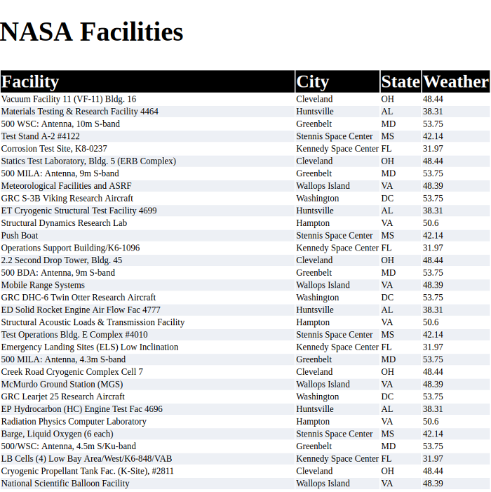

# Complex NASA API
Use NASA's API to return all of their facility locations (~400). Display the name of the facility, its location, and the weather at the facility currently.

## How It's Made:

**Tech used:** HTML5, CSS3, JavaScript, NASA's API & openweathermap's API.
Styling for this project was done using CSS Grid & Flexbox. Written in vanilla Javascript using the fetch method to access NASA's API and use its properties to fetch openweathermap's data.

## Lessons Learned:
Learned more about scoping and about API request limits.

## Examples:

**Weather API** https://github.com/ericamendez/weather-api-bootcamp2018c-week07

**Simple NASA API** https://github.com/ericamendez/simple-nasa-api-bootcamp2018c-week07

**Daily Code Challenges:** https://github.com/Eriquette/Daily-Code-Challenges
